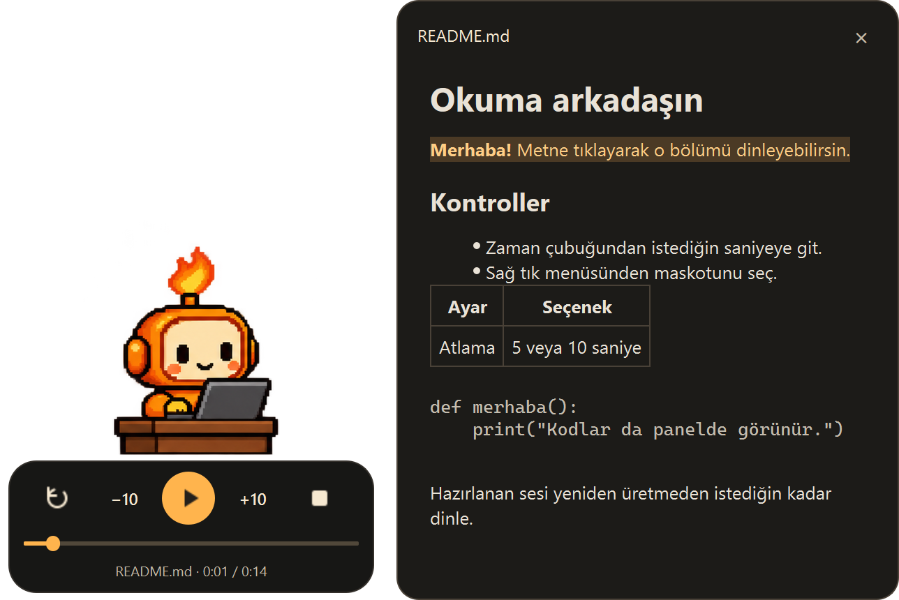
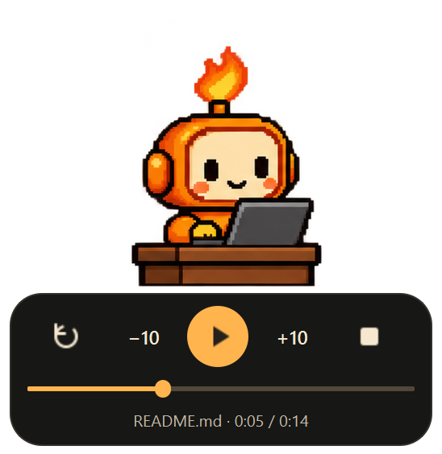
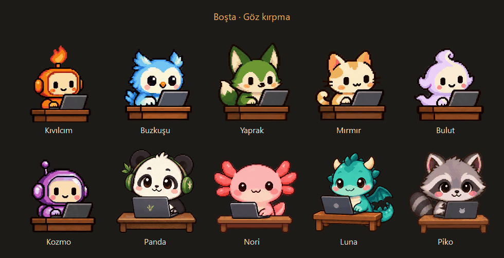
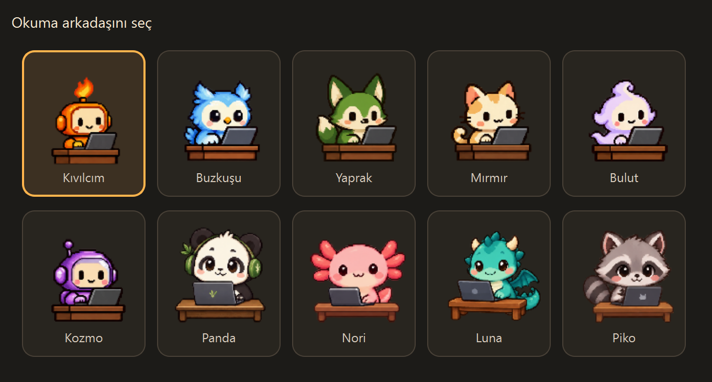

<div align="center">


<h1>MascotReader</h1>

<p><strong>Markdown dosyalarını dinle. Masaüstündeki okuma arkadaşını seç.</strong></p>

<p>Windows için Türkçe Markdown okuyucu.<br>EMA Lightning ile bilgisayarında ses üretir; 10 pixel-art maskot sana eşlik eder.</p>

<p><strong>Çevrimdışı kullanım · Yerel CPU · Windows uygulaması</strong></p>

<p>
  <a href="https://github.com/serhatkochan/mascot-reader/releases/latest/download/MascotReader-Setup.exe"><strong>Windows için indir</strong></a> ·
  <a href="https://mascot-reader.serhatkochan.com">Web sitesi</a> ·
  <a href="#kurulum">Kurulum</a> ·
  <a href="#kontroller">Kontroller</a> ·
  <a href="#maskotlar">Maskotlar</a> ·
  <a href="#geliştirme">Geliştirme</a>
</p>

</div>

<p align="center">
  
</p>

<p align="center"><sub>Gerçek Windows uygulamasından ekran görüntüsü. Dosya adına tıkla, içeriği aç; metinden istediğin bölüme geç.</sub></p>

README'ler, proje notları ve uzun Markdown belgeleri için küçük bir masaüstü arkadaşın.
Maskota tıklayıp dosyanı seç; ses hazırlanırken klavyede yazsın, hazır olduğunda okumaya başlasın.
Şeffaf, çerçevesiz pencereyi sürükleyip istediğin yere bırakabilirsin.

- Zaman çubuğuna tıkla veya sürükle; belgenin istediğin saniyesine git.
- Markdown panelinden okunan bölümü takip et; bir metin bölümüne tıklayarak sesi oraya taşı.
- Hazırlanan sesi yeniden üretmeden duraklat, devam et veya baştan dinle.
- Okuma hızını, kod bloklarını ve 5/10 saniyelik atlama süresini ayarla.
- Hazırlanan sesi WAV olarak kaydet; maskotunu değiştir, üstte tut veya sistem tepsisine gizle.

Model Windows paketine dahildir. Kullanırken internet, API anahtarı, Python kurulumu veya ekran kartı gerekmez.

## Kurulum

Hedef sistem **Windows 10 (1809 ve sonrası) / Windows 11, x64**.
Bu hedef [Qt 6.11'in Windows gereksinimlerine](https://doc.qt.io/qt-6.11/windows.html) dayanır.

1. [MascotReader-Setup.exe dosyasını indir](https://github.com/serhatkochan/mascot-reader/releases/latest/download/MascotReader-Setup.exe), aç ve kurulum adımlarını tamamla.
2. Başlat menüsünden veya masaüstü kısayolundan **MascotReader**'ı aç.
3. Ekranın sağ altındaki maskota tıkla ve bir `.md` veya `.markdown` dosyası seç.
4. Sesin hazırlanmasını bekle. Hazırlama ilerlemesi gösterilir; bittiğinde oynatma otomatik başlar.

Kurulum yönetici izni istemeden geçerli Windows kullanıcısına yapılır.
Varsayılan konum `%LOCALAPPDATA%\Programs\MascotReader`'dır; masaüstü kısayolu
kurulumda seçilebilir. Python, Qt ve ses modeli uygulamaya dahildir.

[Sürüm sayfası](https://github.com/serhatkochan/mascot-reader/releases/latest) ·
[Kurulum dosyasının SHA256 değeri](https://github.com/serhatkochan/mascot-reader/releases/latest/download/MascotReader-Setup.exe.sha256)

**Güncelleme:** Maskotta sağ tık → **Çıkış** yap, ardından sürüm sayfasındaki yeni
`MascotReader-Setup.exe` dosyasını çalıştır. Kurulum mevcut sürümü yeniler;
aynı Windows kullanıcısının maskot seçimi, pencere konumu ve tercihleri korunur.
Uygulama güncellemeleri otomatik denetlemez; yeni sürümü GitHub'dan indirip kurarsın.

**Kaldırma:** Windows Ayarlar → **Uygulamalar** bölümünde veya Denetim Masası →
**Programlar ve Özellikler** ekranında **MascotReader**'ı seçip **Kaldır**'a tıkla.
Uygulama açıksa kaldırıcı önce maskotta veya tepsi simgesinde sağ tık → **Çıkış**
yapmanı ister; ardından **Tamam** ile devam edebilirsin.

## Kontroller

<p align="center">
  
</p>

| Kontrol | Ne yapar? |
| --- | --- |
| Baştan başlat | Hazırlanan sesi sıfırdan oynatır. |
| Geri / ileri | Varsayılan 10 saniye atlar; menüden 5 saniye seçilebilir. |
| Oynat / duraklat | Bulunduğun konumdan devam eder veya konumu koruyarak bekler. |
| Durdur | Başa döner ve bekler. Hazırlama sürüyorsa işlemi iptal eder. |
| Zaman çubuğu | Tıkladığın saniyeye gider. Sürüklerken hedef süreyi gösterir. |
| Dosya adı | Sağ tarafta Markdown panelini açar veya kapatır. |
| Maskot | Tıklayınca yerel dosya seçiciyi açar; sürükleyince pencereyi taşır. |

Zaman çubuğu ses tamamen hazırlandıktan sonra açılır.
Sürüklerken ses geçici olarak duraklar; bıraktığında önceki oynatma durumunu korur.
Duraklatılmış veya durdurulmuş seste zaman değiştirmek oynatmayı başlatmaz.

Pencere odaktayken klavyeyi de kullanabilirsin:

| Tuş | İşlem |
| --- | --- |
| `Boşluk` | Oynat / duraklat |
| `←` / `→` | Geri / ileri atla |
| `Esc` | Durdur |

### Metinden dinle

Dosya adına tıklayınca başlıklar, paragraflar, listeler, tablolar ve kodlar panelde görünür.
Dinlenebilir bir metin bölümüne tıklamak seni o bölümün başına götürür; ses ilerledikçe okunan bölüm vurgulanır.
Oynatma veya duraklatma durumu korunur. Panelin **×** düğmesiyle küçük maskot görünümüne dönersin.

Uzun paragraflar küçük ses bölümlerine ayrılır. Metinden atlama bu bölümlerin başlangıcına yapılır;
kelime düzeyinde atlama yoktur. Kod blokları panelde görünür, ancak yalnız **Kod bloklarını oku** açıkken dinlenebilir.

## Maskotlar

**Sağ tık → Maskot seç…** ile okuma arkadaşını değiştir.
Seçimin hemen uygulanır ve sonraki açılışta hatırlanır. Maskot değiştirmek sesi veya oynatma konumunu etkilemez.

<table>
  <tr>
    <td align="center" width="20%"><br><strong>Kıvılcım</strong><br><sub>Turuncu robot</sub></td>
    <td align="center" width="20%"><br><strong>Buzkuşu</strong><br><sub>Mavi baykuş</sub></td>
    <td align="center" width="20%"><br><strong>Yaprak</strong><br><sub>Yeşil tilki</sub></td>
    <td align="center" width="20%"><br><strong>Mırmır</strong><br><sub>Alacalı kedi</sub></td>
    <td align="center" width="20%"><br><strong>Bulut</strong><br><sub>Lavanta hayalet</sub></td>
  </tr>
  <tr>
    <td align="center"><br><strong>Kozmo</strong><br><sub>Mor astronot</sub></td>
    <td align="center"><br><strong>Panda</strong><br><sub>Kulaklıklı panda</sub></td>
    <td align="center"><br><strong>Nori</strong><br><sub>Pembe aksolotl</sub></td>
    <td align="center"><br><strong>Luna</strong><br><sub>Turkuaz ejderha</sub></td>
    <td align="center"><br><strong>Piko</strong><br><sub>Gri rakun</sub></td>
  </tr>
</table>

Her maskot boşta göz kırpar, ses hazırlanırken yazar, okurken konuşur.
Animasyon boyunca masalar aynı yerde kalır.

<details open>
<summary><strong>10 maskotun animasyonlarını izle</strong></summary>

<p></p>
<p><sub>GIF, uygulamanın maskot bileşenlerinin karelerinden hazırlanmıştır.</sub></p>

</details>

<details open>
<summary><strong>Uygulamadaki maskot seçim ekranını gör</strong></summary>

<p></p>

</details>

## Sağ tık menüsü

| Seçenek | Davranış |
| --- | --- |
| Markdown dosyası aç… | `.md` ve `.markdown` dosyaları için Windows dosya seçicisini açar. |
| WAV olarak kaydet… | Hazırlanmış sesi Windows kayıt penceresiyle dışa aktarır. |
| Maskot seç… | 10 maskot arasından seçim yapar. |
| Okuma hızı | 0,5–2× arasında değişir; varsayılan 1×. |
| Kod bloklarını oku | Kod bloklarını seslendirmeye ekler; varsayılan kapalı. |
| Geri / ileri atlama | Geri / ileri düğmeleri için 5 veya 10 saniye seçer. |
| Her zaman üstte | Maskotu diğer pencerelerin üzerinde tutar; varsayılan açık. |
| Maskotu gizle / göster | Gizlenen maskotu sistem tepsisi simgesinden geri açabilirsin. |
| Çıkış | Uygulamayı kapatır ve geçici ses dosyalarını temizler. |

Hız veya kod okuma ayarı değişince açık belge yeniden hazırlanıp baştan oynar.
Dosya seçimini iptal etmek mevcut okumayı korur; yeni dosya seçmek önceki işlemi durdurur.

## Belge ve ses hakkında

- Dosyalar UTF-8 olmalıdır; UTF-8 BOM da desteklenir. Kaynak Markdown dosyası değiştirilmez.
- Başlıklar, paragraflar, listeler ve tablo metinleri sırayla okunur. Bağlantıların görünen metni ve satır içi kodlar korunur.
- Ses tamamen hazırlandıktan sonra oynar. Uzun belgelerde hazırlama süresi bilgisayarına ve belge uzunluğuna göre değişir.
- Ses küçük parçalar halinde **48 kHz, mono, PCM16 WAV** dosyasına yazılır; bütün belgenin sesi RAM'de tutulmaz.
- Türkçe ve tek ses desteklenir. Yabancı kelimeler Türkçe telaffuz kurallarıyla okunabilir. Ses yapay zekâ üretimidir.
- Panel hazırlanmış belgenin kopyasını gösterir. Dosyayı başka yerde düzenlediysen yeni metni dinlemek için yeniden aç.
- Görsellerin açıklamaları gösterilir; panel uzak görselleri indirmez veya harici bağlantıları açmaz.

Pencere konumu ve tercihler Windows kullanıcı ayarlarında saklanır.
Model performans önbelleği `%LOCALAPPDATA%\MascotReader\cache` altındadır.
Model sürümü pakette sabittir; otomatik model güncellemesi yapılmaz.

## Geliştirme

Doğrulanan geliştirme ortamı **Python 3.11, Windows x64 ve CPU PyTorch**.
Aşağıdaki komutları proje klasöründe çalıştır. Kaynak kurulumu ve ilk model indirmesi internet gerektirir;
model hazırlandıktan sonra uygulama çevrimdışı çalışır.

```powershell
py -3.11 -m venv .venv
.\.venv\Scripts\python.exe -m pip install torch==2.14.1+cpu --index-url https://download.pytorch.org/whl/cpu
.\.venv\Scripts\python.exe -m pip install -e ".[dev]" -c requirements-lock.txt
.\.venv\Scripts\python.exe scripts\fetch_model.py
.\.venv\Scripts\python.exe -m mascot_reader
```

| Bileşen | Kullanımı |
| --- | --- |
| Python 3.11 + PySide6 | Şeffaf masaüstü penceresi, dosya seçiciler ve sistem tepsisi |
| EMA Lightning + CPU PyTorch | Yerel Türkçe ses üretimi |
| markdown-it-py | Markdown ayrıştırma |
| QMediaPlayer + QAudioOutput | Oynatma, duraklatma ve konuma atlama |
| PyInstaller `onedir` | Modeli içeren taşınabilir Windows paketi |
| Inno Setup | Kullanıcıya özel Windows kurulumu, güncelleme ve kaldırma |

Bağımlılıkların denenmiş sürümleri `requirements-lock.txt` içinde sabitlenmiştir.
Model indirme betiği `resources/model-manifest.json` içindeki sürümü, dosya boyutlarını ve SHA256 değerlerini denetler.

### Test ve paketleme

```powershell
.\.venv\Scripts\python.exe -m pytest
.\.venv\Scripts\python.exe -m ruff check src tests scripts MascotReader.spec
powershell -ExecutionPolicy Bypass -File scripts\build_windows.ps1
```

Hazır model önbelleğiyle çevrimdışı derlemek için son komuta `-SkipModelDownload` ekle.
Bu adım `dist/MascotReader` uygulama klasörünü, `dist/MascotReader-windows-x64.zip`
arşivini ve yanındaki SHA256 dosyasını oluşturur. Setup EXE için Inno Setup'ı kur
ve derleyicinin yolunu ver:

```powershell
powershell -ExecutionPolicy Bypass -File scripts\build_installer.ps1 -Iscc "C:\Program Files (x86)\Inno Setup 6\ISCC.exe"
```

`ISCC.exe` yolunu kendi Inno Setup kurulumuna göre değiştir.
Çıktı `dist/MascotReader-Setup.exe` ve `dist/MascotReader-Setup.exe.sha256` dosyalarıdır.
Yalnız README, belgeler veya README görselleri değiştiyse mevcut EXE ile paketi yenileyebilirsin:

```powershell
.\.venv\Scripts\python.exe scripts\package_windows.py
```

Ardından Setup EXE'yi yenilemek için kurulum derleme komutunu tekrar çalıştır.

[Paketleme ayrıntıları](docs/packaging.md) · [Doğrulama kayıtları ve test sınırları](docs/verification.md)

Son kaynak koşusunda **204 test** geçti; 10 maskotun **120 animasyon karesi** için masa sabitliği ve kurulum/yayın korumaları kontrol edildi.
Paketlenmiş EXE ayrıca ağ bağlantıları engellenmiş gerçek model ve oynatma denetimlerinden geçti.
Ayrı temiz Windows kurulumu ve fiziksel çoklu monitör kontrolünün durumu doğrulama belgesinde açıklanır.

## Kaynaklar ve lisanslar

Seslendirme [EMA Lightning](https://github.com/canberk7/ema-lightning) ve
[canberkkkkkk/ema-lightning modelini](https://huggingface.co/canberkkkkkk/ema-lightning) kullanır.
Model ve `normalizer-tr` Apache-2.0 lisanslıdır. Qt, FFmpeg, Python ve dağıtılan bağımlılıkların
lisans metinleri Windows paketinin `_internal/licenses` klasöründe bulunur.

Maskotlar, kullanıcının görselini stil referansı alan özgün pixel-art görsellerdir ve imagegen ile üretilmiştir.
Katalog, sprite sheet'ler, animasyon metadata dosyaları ve üretim istemleri `resources/mascots` altındadır.
Bu README'deki ekran görüntüleri gerçek Windows uygulamasından; maskot görselleri ve GIF ise uygulamanın kendi çiziminden alınmıştır.
